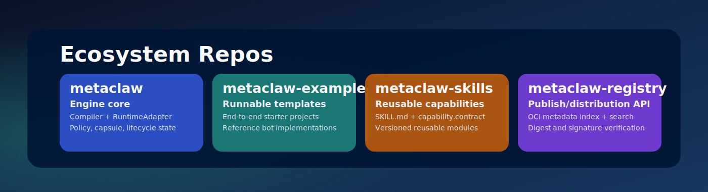

# metaclaw-skills

Reusable capability modules for MetaClaw.

## Repository Boundary

This repo is for reusable skills only.

- includes: `SKILL.md`, `capability.contract.yaml`, skill lint/tests, versioned skill implementations
- excludes: full business bots/workflows, engine runtime internals, registry server code

## Ecosystem Repo Map



| Repo | Primary Responsibility | URL |
| --- | --- | --- |
| `metaclaw` | Engine core: compiler, runtime adapters, lifecycle/state | https://github.com/fpp-125/metaclaw |
| `metaclaw-examples` | Runnable end-to-end examples and starter templates | https://github.com/fpp-125/metaclaw-examples |
| `metaclaw-skills` | Reusable capabilities (`SKILL.md` + `capability.contract`) | https://github.com/fpp-125/metaclaw-skills |
| `metaclaw-registry` | Publish/distribution backend for skill/capsule metadata | https://github.com/fpp-125/metaclaw-registry |

## What Is capability.contract?

`capability.contract` declares what a skill needs and what it is compatible with.

Typical fields:

- required mounts/network/env/secrets
- runtime compatibility (`docker` / `podman` / `apple_container`)
- contract version for compile-time enforcement

MetaClaw uses this contract at compile time to reject unsafe or incompatible integrations.

## Layout

- `skills/<name>/SKILL.md`
- `skills/<name>/capability.contract.yaml`

Example: `skills/obsidian.search/`

## Validate

```bash
go run ./cmd/skilllint ./skills
go test ./...
```

## Publish Flow

1. Implement skill + contract.
2. Tag version.
3. Build and publish skill artifact to OCI registry (for example `ghcr.io`).
4. Register metadata in `metaclaw-registry`.

## Related Repos

- engine: https://github.com/fpp-125/metaclaw
- examples: https://github.com/fpp-125/metaclaw-examples
- registry backend: https://github.com/fpp-125/metaclaw-registry
